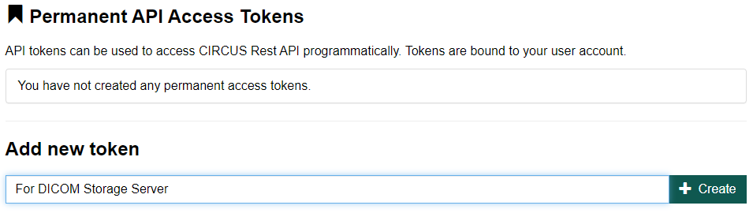
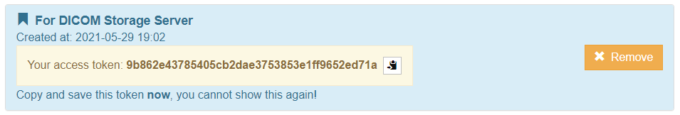

## Parmanent access tokenの作成

CIRCUSのAPIを使用する場合や、DICOM Storage ServerのDocker imageを使用するためには、使用するユーザのparmanent access tokenを作成する必要があります。

### Web画面にて作成

画面上部のメニューより[Tool] - [Access Tokens]を選択すると永続接続トークンの作成画面が表示されます。

1. トークンを作成するためには、画面下部の"Add new token"のテキストボックスにを短い説明文を入力し、[Create]ボタンをクリックします。

  

2. するとtokenが生成されますので、tokenをコピーして、適切に保管してください（token右側のアイコンをクリックするとクリップボードにコピーされます）。

  

  :::caution

  上記画面で表示されているtokenは再度表示されません。access tokenはユーザログインの代わりとなるものですので、厳重に保管してください。

  :::

### コマンドラインにて作成 (Docker版 CIRCUSの場合)

CIRCUS の Docker imageで /bin/bash を実行し、以下のコマンドを実行します。

    # /root/servicies.sh & (バックグラウンド実行)
    # cd /var/circus/circus-api
    # node circus add-permanent-token [ユーザ名(circus or 他ユーザ)]