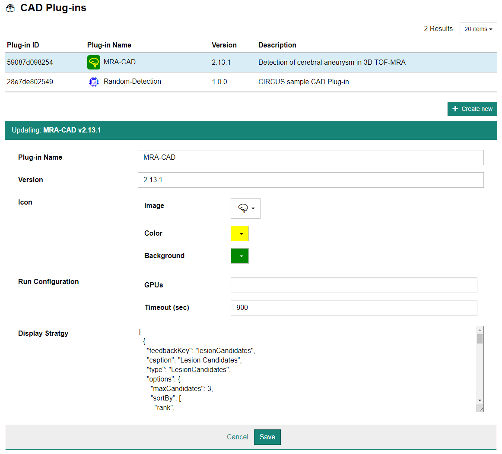

画面上部のメニューより [Administration] - [CAD Plug-ins] を選択すると CAD プラグイン設定画面が表示されます。

:::caution

この画面ではプラグイン (Docker image) の新規登録が行えません。[CIRCUS CS プラグインの登録手順](registration-cs-plugins.md)に従って登録してください。

:::

登録済のプラグインに対して変更を行う場合は、上部リストより設定を変更したいプラグインの行をクリックします。ページ下部に設定画面が表示されますので、適宜設定した上で [Save] ボタンをクリックします。

:::note

基本的には設定を変更する必要がありません。マシン環境によっては "Timeout (sec)"（処理の制限時間）の設定を変更する必要があります。

:::
