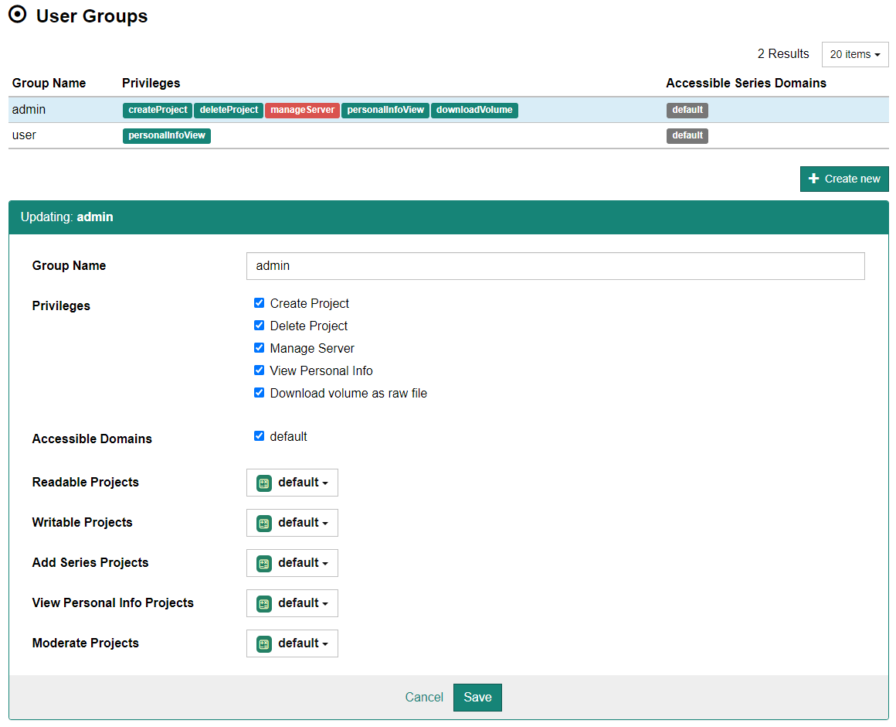

## グループの設定

画面上部のメニューより [Administration] - [Groups] を選択するとグループ設定画面が表示されます。

新たなグループを作成する場合はまず、[+ Create new] ボタンをクリックします。ページ下部に設定画面が表示されますので、各項目を設定した上で [Save] ボタンをクリックします。

既存のグループに対して変更を行う場合は、上部リストより設定を変更したいグループの行をクリックします。ページ下部に設定画面が表示されますので、適宜設定した上で [Save] ボタンをクリックします。

:::caution

2021.6 時点では、この画面よりグループの削除は行えません。

:::

## 各グループの設定項目

Group Name
: グループ名を入力します（後から変更可能です）。

Privileges
: グループに属するグローバル権限を設定します。設定可能な権限の種類は以下を参照してください。

Accessible Domains
: アクセスできる DICOM 画像のドメインを設定します。

### グループに付与できるグローバル権限

Create Project
: プロジェクトの作成が行えます。

Delete Project
: プロジェクトの作成が行えます。

Manage Server
: サーバの各種設定が行えます。いわゆる管理者権限です。

View Personal Info
: 患者個人情報（患者 ID・氏名・生年月日）を表示できます。この権限がない場合、患者個人情報はマスクされます。なお、この権限を有するユーザであっても、[個人設定画面](../users/user-preference)より一時的に個人情報を非表示にすることができます。

Download volume as raw file
: ボリュームデータのダウンロードを可能にします。

### プロジェクトに関する設定項目

CIRCUS DB のプロジェクトに関する設定項目です。各項目とも複数のプロジェクトに対して権限付与が可能です。

Readable Projects
: プロジェクトを閲覧できる権限です。

Writable Projects
: プロジェクト内のケースに対して書込が行える権限です。

Add Series Projects
: プロジェクトのケースに対して DICOM シリーズの追加が行える権限です。

View Personal Info Projects
: プロジェクトのケースの個人情報（患者 ID、患者氏名など）を表示できる権限です。

Moderate Projects
: プロジェクトに関するあらゆる処理が行える権限です。
