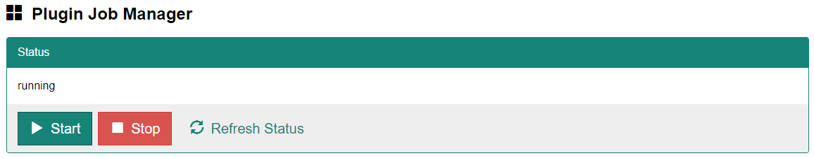

Select [Administration] - [Job Manager] from the menu at the top of the screen to display the user settings screen.

This screen allows you to run, stop, and check the status of Plug-in Job Manager. To run plug-ins, set Plug-in Job Manager to the "running" state.

