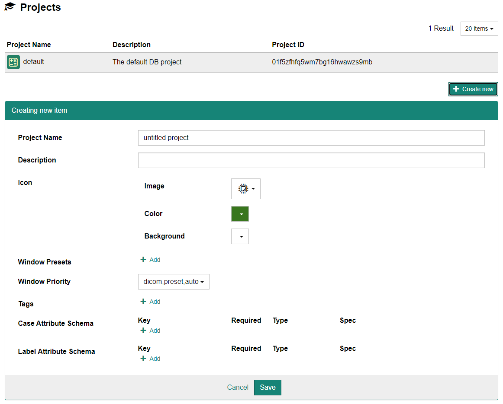
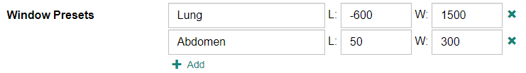
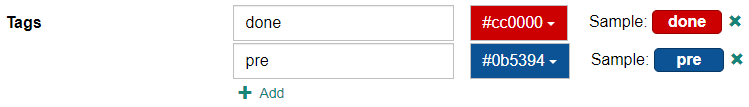
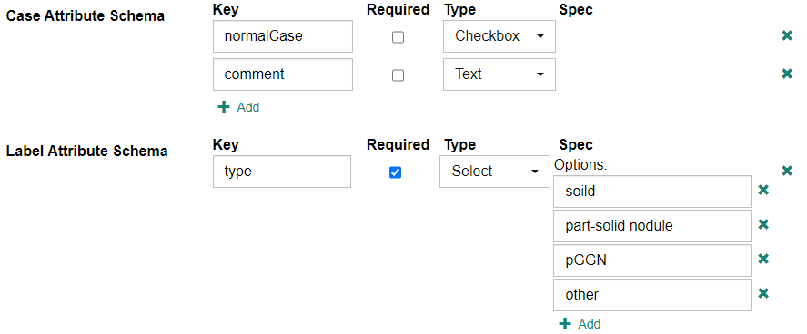

## プロジェクトの設定

画面上部のメニューより[Administration] - [Projects]を選択するとプロジェクト設定画面が表示されます。

- 新規プロジェクトを作成する場合はまず、[+ Create new]ボタンをクリックします。ページ下部に設定画面が表示されますので、各項目を入力した上で[Save]ボタンをクリックします。

    

- 既にあるプロジェクトに対して変更を行う場合は、上部リストより設定を変更したいプロジェクトの行をクリックします。ページ下部に設定画面が表示されますので、適宜設定した上で[Save]ボタンをクリックします。

## 各プロジェクトの設定項目

### Project Name

プロジェクト名を入力します。

### Description

プロジェクトの概要を説明する短い文字列を入力します。

### Icon

プロジェクトのアイコンを設定します。アイコンはImage（イラスト）、Color（イラストの線色）、Background（背景色）をそれぞれ選択します。

### Window Presets

Case Detail画面でDICOM画像を表示する際のwindow level、window widthのpresetを設定できます。

### Window Priority

Case Detail画面でDICOM画像（ボリュームデータ）を表示する際のwindow level、window widthの初期値を決める方法の優先度の順を選択できます。

- preset："Window Presets"で設定した値を使用します。複数設定されている場合は1番目の値を使用し、設定されていない場合は無視されます。
- dicom：ボリュームデータ中央のDICOMファイルにwindow center(0x0028, 0x0050)、window width(0x0028, 0x0051)タグが存在すればその値を使用し、存在しない場合は無視します。
- auto：ボリュームデータの画素値の最小値／最大値を基にwindow level、window widthを自動設定します。

### Tags

ケースに対して付けるタグを設定できます。

:::note

ケースに対して付けられるタグはここで設定したものに限られます。

:::

### Case Attribute Schema, Label Attribute Schema

ケースおよびラベルに対する属性情報の入力項目が設定できます。内部データベースではJSON形式のkey(キー)とvalue(値)の組で保存されます。

#### Key

データベースに保存するkeyです。Case Info画面では項目名として表示されます。

#### Required 

必須入力項目としたい場合はチェックを入れます。

### Type

設定できる入力データの種類を

| Type | 説明 |
|---|---|
| Text | テキストを入力します。 |
| Number | 数値を入力します。 |
| Integer | 整数値を入力します。 |
| Checkbox | true / false の2択をラジオボタンで選択します。 |
| Select | プルダウンメニューにて**Spec**で設定した項目のうち1つを選択します。 |

### Spec

TypeでSelectを選択した場合に、プルダウンメニューの項目を設定します。

