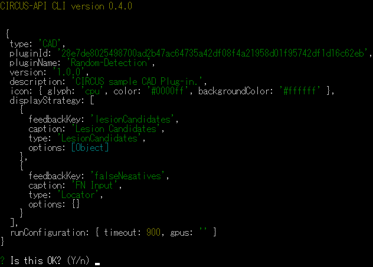
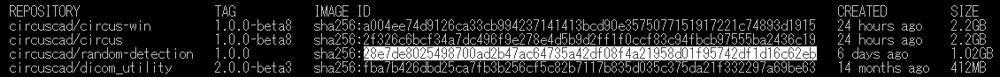

## CIRCUS CS プラグインの登録手順

エクスポートされた Docker イメージ (xxx_ver.1.0.0.tar) を CIRCUS CS のプラグインとして登録するためには以下で行います。

### 準備

docker load コマンドで Docker image を読み込みます。

```
$ docker load -i xxx_ver.1.0.0.tar
```

### Docker コンテナ内でスクリプトを実行する場合（推奨）

CIRCUS の Docker コンテナ内部で CIRCUS を起動した後、以下のコマンドを実行してください。

```
# /root/cad_plugin_registration.sh [REPOSITORY]:[TAG]
```

登録の途中で下図のように確認画面が求められたら、"Y" と入力し、[Enter]キーを押します。



:::tip
コマンド実行に必要な [REPOSITORY] および [TAG] は `docker images` コマンドで調べてください。
:::

### CIRCUS の Docker コンテナ内で API を直接実行する場合

1. 読み込んだプラグインの Docker image の full ID を取得します。

```
$ docker images --no-trunc
```

    - 登録するDocker イメージ の Image ID 列の "sha256:" に続く文字列が登録に必要な full ID です（下図参照）。

       

1. CIRCUS の Docker コンテナ内で以下のコマンドを実行し、CIRCUS CS プラグインの情報を登録します。

```shell-session title="コンテナ内"
# /root/servicies.sh &
# cd /var/circus/packages/circus-api
# node circus register-cad-plugin [取得したDocker イメージの full ID]
```

- 登録の途中で下図のように確認画面が求められたら、"Y" と入力し、[Enter]キーを押します。

  

## CIRCUS CS の プラグインで GPU を使用する場合(Linux のみ、オプション)

CUDA ドライバをインストール後、nvidia-container-runtime のインストール、ならびにホスト側の Docker の設定を行います。

1. nvidia-container-runtime の リポジトリを追加します。

```
$ curl -s -L https://nvidia.github.io/nvidia-container-runtime/gpgkey | sudo apt-key add -
$ distribution=$(. /etc/os-release;echo $ID$VERSION_ID)
$ curl -s -L https://nvidia.github.io/nvidia-container-runtime/$distribution/nvidia-container-runtime.list | sudo tee /etc/apt/sources.list.d/nvidia-container-runtime.list
$ sudo apt update
```

1. nvidia-container-runtime をインストールし、再起動をします。

   ```
   $ sudo apt install nvidia-container-runtime
   $ sudo reboot
   ```

1. /etc/docker/daemon.json に以下の内容を記載します（要：sudo）。

   ```
   {
       "default-runtime": "nvidia",
       "runtimes": {
           "nvidia": {
               "path": "/usr/bin/nvidia-container-runtime",
               "runtimeArgs": []
           }
       }
   }
   ```
