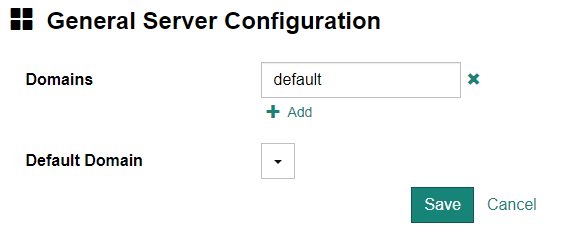

Select [Administration] - [Server Configuration] from the menu at the top of the screen to display the server settings screen.

Currently, only domain settings can be configured.

## Domain Settings

You can add, change, and delete domains in **Domains**. You can also change the settings for **Default Domain**. Click the [Save] button to reflect the changed settings.

