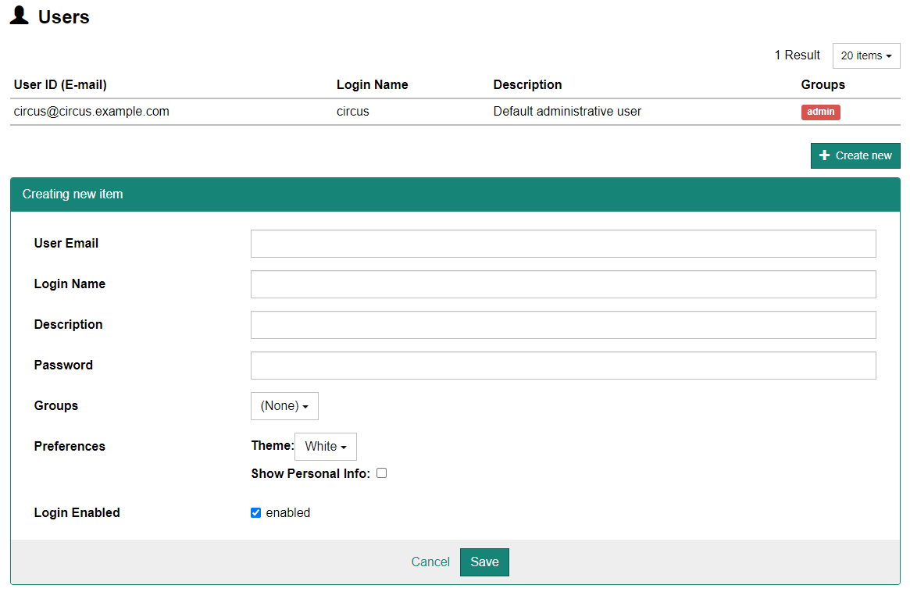

## ユーザの設定

画面上部のメニューより[Administration] - [Users]を選択するとユーザ設定画面が表示されます。

- 新規ユーザを作成する場合はまず、[+ Create new]ボタンをクリックします。ページ下部に設定画面が表示されますので、各項目を入力した上で[Save]ボタンをクリックします。

    

  :::caution

  登録後、メールアドレスの変更は行えません。       

  :::

- 既にあるユーザに対して変更を行う場合は、上部リストより設定を変更したいユーザの行をクリックします。ページ下部に設定画面が表示されますので、適宜設定した上で[Save]ボタンをクリックします。

## 各ユーザの設定項目

### Login Name

ログイン名のエイリアスです。

### Description

画面右上(Logoutボタンの横)に表示されるユーザ名（氏名など）を設定します。

### パスワード

パスワードを設定します。変更の場合は空白で表示されています。

### Groups

ユーザが所属するグループを設定します。ユーザは複数のグループに所属することができ、そのレベルで CIRCUS 内の様々な操作への権限が付与されます（個々のユーザのレベルでは権限情報を持っていません）。

### Preferences

ユーザの環境を設定します。

#### Theme

各ページの背景色を設定します（白 or 黒）

#### Show Personal Info

そのユーザが患者個人情報（患者ID・氏名・生年月日）を表示できるかどうかを設定します。

### Login Enabled

そのユーザによるログインを許可するかどうかを設定します。
