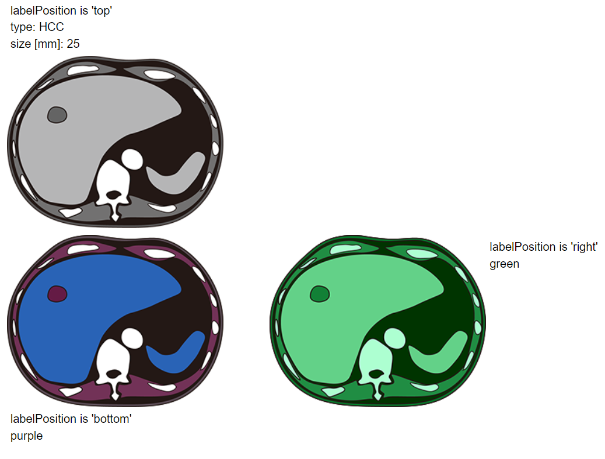

`Gallery` is a display that shows result images with labels.

## Example



## Synopsis

```json title=displayStrategy
[
  {
    "type": "Gallery",
    "options": {
      "imageInfo": [
        {
          "fileName": "gray.png",
          "labelData": [
            {
              "customLabel": "labelPosition is 'top'"
            },
            {
              "customLabel": "type:",
              "dataPath": "results.volumes.0.candidate.0.type"
            },
            {
              "customLabel": "size [mm]:",
              "dataPath": "results.volumes.0.candidate.0.size"
            }
          ],
          "labelPosition": "top"
        },
        {
          "fileName": "purple.png",
          "labelData": [
            {
              "customLabel": "labelPosition is 'bottom'"
            },
            {
              "dataPath": "results.volumes.0.color.1"
            }
          ],
          "labelPosition": "bottom"
        },
        {
          "fileName": "green.png",
          "labelData": [
            {
              "customLabel": "labelPosition is 'right'"
            },
            {
              "dataPath": "results.volumes.0.color.2"
            }
          ],
          "labelPosition": "right"
        }
      ],
      "imageCountsPerColumn": [1, 2]
    }
  }
]
```

## Data Preparation

The plug-in results (`results.json`) corresponding to above Gallery example is as follows:

```json
{
  "results": {
    "volumes": [
      {
        "candidate": [{ "type": "HCC", "size": "25" }],
        "color": ["gray", "purple", "green"]
      }
    ]
  }
}
```

### Result Image

`Gallery` suppports some types of graphic files.  
There are: PNG(.png), JPEG(.jpg, .jpeg), GIF(.gif), WebP(.webp), SVG(.svg), APNG(.apng), and AVIF(.avif).  
In the case of the example above, you need to prepare images as follows:

```
📂/circus/
    📂out/
        results.json
        gray.png
        purple.png
        green.png
```

## Options

```ts
interface GalleryOptions {
  imageInfo: {
    fileName: string;
    labelData?: {
      customLabel?: string;
      dataPath?: string;
    }[];
    labelPosition?: 'left' | 'right' | 'top' | 'bottom';
  }[];
  imageCountsPerColumn?: number[];
}
```

- `fileName`: The image file path.
- `customLabel`: (default: undefined) Set label directly by string.
- `dataPath`: (default: undefined) Set label from `results.json`.
- `labelPosition`: (default: 'bottom') Change label position relative to image.
- `imageCountsPerColumn`: (default: `Array(imageInfo.length).fill(1)`) Change number of images per column. Sum of `imageCountsPerColumn` must be the length of `imageInfo`.
