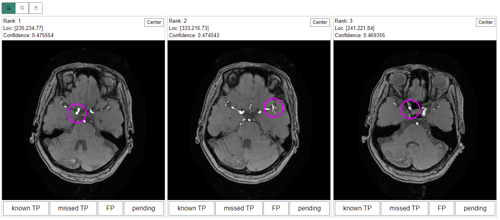

The LesionCandidates display presents volumes with marks of interest.

## Example



## Synopsis

```json
[
  {
    "feedbackKey": "lesionCandidates",
    "caption": "Lesion Candidates",
    "type": "LesionCandidates",
    "options": {
      "maxCandidates": 3,
      "feedbackListener": {
        "type": "Choice",
        "options": {
          "personal": [
            { "caption": "Yes", "value": 1 },
            { "caption": "No", "value": 0 }
          ]
        }
      }
    }
  }
]
```

## Data Preparation

The plug-in results (`results.json`) must contain an array data containing the locations of points in the following format:

```ts
Array<{
  id?: number;
  rank: number;
  confidence: number;
  volumeSize: number;
  volumeId?: number;
  location: [number, number, number];
}>;
```

`metadata` in the plug-in results can contain additional options for each volume. That can contain display options in the following format:

```ts
interface displayOptions: Array<
      {
        volumeId?: number,
        window?: {
          level: number,
          width: number
        },
        crop?: {
          origin: [number, number, number],
          size: [number, number, number]
        }
      }>
```

For exmaple:

```json
{
  "metadata": {
    "displayOptions": [
      {
        "volumeId": 0,
        "window": {
          "level": 152,
          "width": 356
        },
        "crop": {
          "origin": [20, 6, 0],
          "size": [636, 728, 128]
        }
      }
    ]
  },
  "results": {
    "lesionCandidates": [
      {
        "rank": 1,
        "confidence": 0.475554,
        "volumeId": 0,
        "location": [235, 234, 77],
        "volumeSize": 11.74
      },
      {
        "rank": 2,
        "confidence": 0.474043,
        "volumeId": 0,
        "location": [333, 216, 73],
        "volumeSize": 11.02
      },
      {
        "rank": 3,
        "confidence": 0.469355,
        "volumeId": 0,
        "location": [241, 221, 84],
        "volumeSize": 3.91
      }
    ]
  }
}
```

Your array should usually be located at `results.lesionCandidates`, but this can be configured via the `dataPath` option. This is useful when you want to display two different series of candidates in one screen.

## Options

```ts
interface MarkStyle {
  color?: string;
  dimmedColor?: string;
  radius?: number;
  width?: number;
}

interface LesionCandidatesOptions {
  dataPath?: string;
  feedbackListener?: DisplayDefinition | null;
  maxCandidates?: number;
  markStyle?: MarkStyle;
  confidenceThreshold?: number;
  sortBy?: [keyof LesionCandidate, 'asc' | 'desc'];
  excludeFromActionLog?: boolean;
}
```

- `dataPath: string`: (default: "results.lesionCandidates") Changes where to read the location data from.
- `feedbackListener: { type: string; options: any }`: Can be used to collect feedback data for each displayed candidates. See below.
- `maxCandidates: number`: The maximum number of candidates that can be displayed.
- `markStyle`: (defalut: magenta circle) The radius [mm], color and line width of the mark.
- `confidenceThreshold: number`: If set, candidates with confidences below this value will be excluded.
- `sortBy`: (default: ['rank', 'asc']) Sorts the displays according to the key.
- `excludeFromActionLog: boolean`: (default: false) If set to true, nothing will be recorded to the action log regarding this display.

## Nested Dispaly to Collect Feedback

You can use `feedbackListener` option to collection feedback for each lesion candidate displayed on screen.
