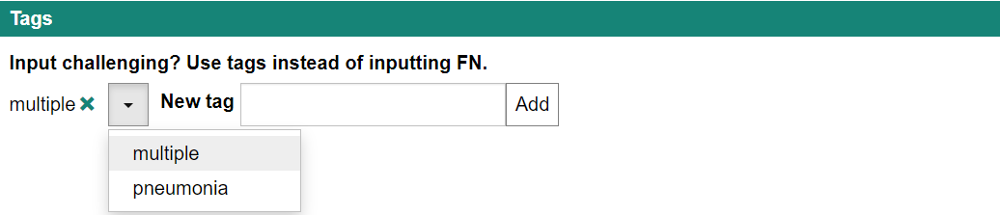

`Tags` provides a straightforward way to gather feedback, offering both a drop-down list for predefined options and a free text input for custom responses. It is designed to prevent the selection of duplicate items, ensuring each tag is unique.

## Example



## Synopsis

```json title=displayStrategy
[
  {
    "feedbackKey": "tags",
    "caption": "Tags",
    "type": "Tags",
    "options": {
      "label": "Input challenging? Use tags instead of inputting FN.",
      "predefinedTags": ["multiple", "pneumonia"],
      "maxItems": 10,
      "minItems": 0,
      "acceptFreeText": true,
      "freeTextPattern": ".*",
      "freeTextLabel": "New tag"
    }
  }
]
```

## Options

```ts
interface TagsOptions {
  label?: string;
  predefinedTags?: string[];
  acceptFreeText?: boolean;
  /**
   * RegExp string that can be passed to `new RegExp()` to validate free text.
   */
  freeTextPattern?: string;
  minItems?: number;
  maxItems?: number;
  initialValue?: string[];
  freeTextLabel?: string;
}
```

- `label`: Displays a caption above the drop-down list.
- `predefinedTags`: (default: []) Sets predefined tags for the drop-down list.
- `acceptFreeText`: (default: false) Allows any string to be added as a tag if set to true, based on the freeTextPattern.
- `freeTextPattern`: (default: '.\*') A regular expression used to validate the free text.
- `minItems`: (default: 0) Specifies the minimum number of tags required.
- `maxItems`: (default: 10) Specifies the maximum number of tags allowed.
- `initialValue`: (default: []) Sets the tags that are initially applied.
- `freeTextLabel`: (default: undefined) Displays a caption to the left of the input box for free text if specified.
