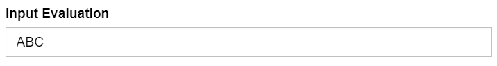

The `Text` shows an input box to collect a string-type feedback.

## Example



## Synopsis

```json title=displayStrategy
[
  {
    "feedbackKey": "text",
    "caption": "Text",
    "type": "Text",
    "options": {
      "label": "Enter 5-digit hexadecimal value",
      "maxLength": 5,
      "minLength": 5,
      "pattern": "^[0-9a-fA-F]$"
    }
  }
]
```

## Options

All options are optional.

- `label: string`: If set, shows a caption above the input control.
- `maxLength: number`: (default: 64) Sets the maximum length of the input string.
- `minLength: number`: (default: undefined) Sets the minimum length of the input string. When undefined, an empty string will be valid.
- `pattern: string`: A regular expression for validation.

## Note

This can be used at the "root" level of `displayStrategy`, but it is also suitable as the `feedbackListener` of the [LesionCandidates](./lesion-candidates.md) display.
