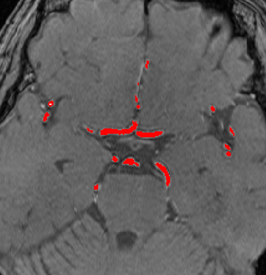

`VolumeOverlay` is a display that shows an input series with volume data overlaied on it. This is typically used by plug-ins that perform volumetry and segmentation.

## Example



## Synopsis

```json title=displayStrategy
[
  {
    "type": "VolumeOverlay",
    "options": {
      "colorMap": {
        "S1": "#ff000088",
        "S2": "#00ff0088"
      }
    }
  }
]
```

## Data Preparation

import { Required } from './label';

The plug-in results (`results.json`) must contain an array data containing the volume information in the following format:

```ts
Array<{
  volumeId?: number;
  name: string;
  origin: [number, number, number];
  size: [number, number, number];
  rawFile?: string;
}>;
```

- `volumeId`: (default: 0) The volume ID which this overlaid volume corresponds to.
- `name`: <Required /> The name of this volume (e.g., "spleen", "left-upper-lobe")
- `origin`: <Required /> Where to overlay the volume.
- `size`: <Required /> The size of the volume in pixels.
- `rawFile`: (default: `${name}.raw.gz`) The file name of the overlaid voxel data.

For example:

```json
{
  "results": {
    "volumes": [
      { "name": "S1", "origin": [120, 35, 80], "size": [233, 152, 25] },
      { "name": "S2", "origin": [145, 40, 93], "size": [180, 93, 19] }
    ]
  }
}
```

Your array should usually be located at `results.volumes`, but this can be configured via the `dataPath` option. This is useful when you want to display two different series of volumes in one screen.

### Raw Voxel Data

In addition to the text/numerical data output to `results.json`, the plug-in must output the voxel data itself as a gzipped 1 bit/voxel RAW file. In the case of the example above, you must prepare a RAW file called `S1.raw.gz`, which is a gzip-compressed binary data that will be 42000 (`Math.ceil(120 * 35 * 80 / 8)`) bytes when decompressed. The first bit corresponds to the voxel at (0, 0, 0), and the next bit, (0, 0, 1), and so on.

```
📂/circus/
    📂out/
        results.json
        S1.raw.gz
        S2.raw.gz
```

## Options

```ts
interface VolumeOverlayOptions {
  volumeId?: number;
  dataPath?: string;
  colorMap?: { [key: string]: ColorDefinition };
  defaultColor?: ColorDefinition;
  only?: string[];
}
```

- `volumeId`: (default: 0) The ID of the base volume to display.
- `dataPath`: (default: "results.volumes") Changes where to read the volume data from.
- `colorMap`: (default: {}) Colors of the overlaid volumes. The keys are the names of the volumes defined in the results file.
- `defalutColor`: (default: 'ffff0088') The fallback color used when there is no matching key in `colorMap`.
- `only`: (default: undefined) If an array of names is set, only shows the volumes with the names specified here.
