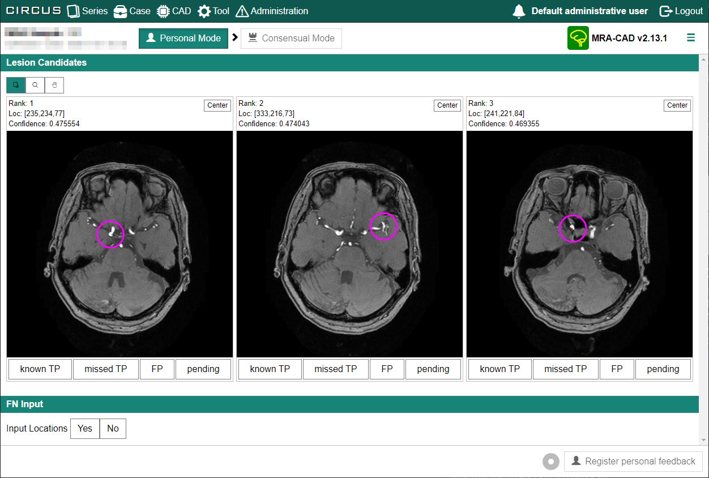
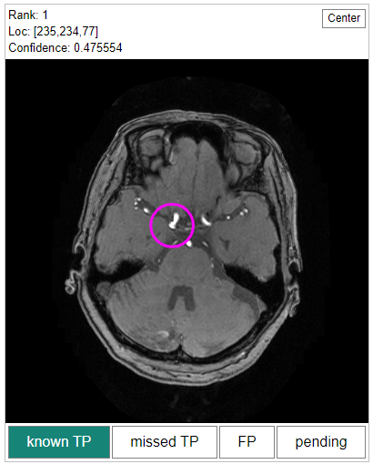
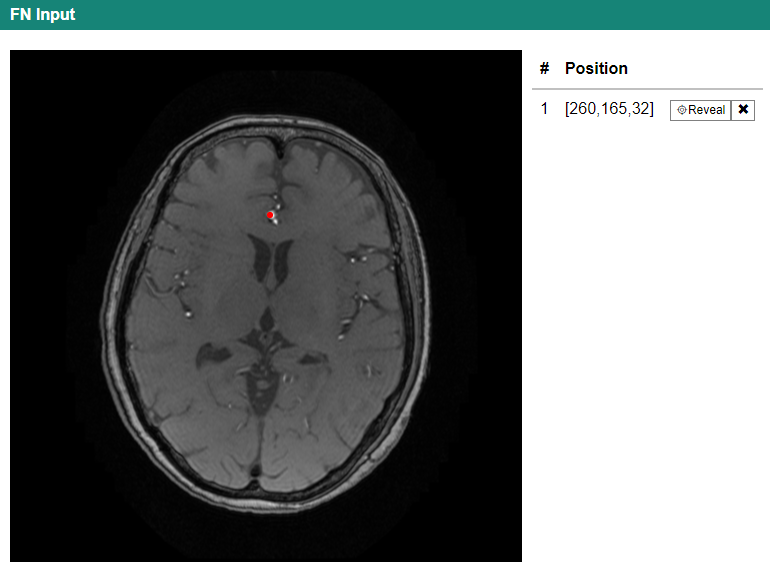

## プラグイン結果画面の閲覧

プラグイン（CAD ソフトウェア）の処理結果を閲覧するためには、Plug-in Job Search のリスト各行にある [View] ボタンをクリックします。

この結果画面は、CIRCUS CS の病変検出系プラグインを使用した場合の代表的な画面の一例です。複数の病変候補が並んでおり、病変の位置にマーカーが記されています。マウスホイールを使用して前後のスライスをページングして確認することもできます。

それぞれの病変候補の下側には、「known TP」「FP」などのボタンが表示されています。これがフィードバック入力インターフェースです。

:::tip

この画面はあくまで一例です。CIRCUS CS は、プラグインによって結果表示を柔軟にカスタマイズできる機能を有しています。実際に表示される結果や、使用できる機能、取得されるフィードバックの種類は、インストールされているプラグインの構成によって異なります。プラグインの種類や管理者の設定によっては、フィードバック取得機能が存在しない場合もあります。

:::

## フィードバックの入力

### フィードバックの種類

フィードバックの入力は、個々のユーザが評価を入力する個人 (personal) フィードバック、および複数ユーザの個人フィードバックを統合し、最終的な評価を入力する統合(consensual) フィードバックの 2 段階により行います。

入力したフィードバックは、CAD ソフトウェアの性能評価・性能改善、各ユーザの読影傾向の解析などに使用することができます。

### 病変検出系プラグインでのフィードバック入力

以下では、上で示した脳動脈瘤肺結節検出ソフトウェアを例に挙げて、CIRCUS CS での代表的なフィードバック入力方法を説明します。

この脳動脈瘤検出ソフトウェアでは、病変候補ごとに評価を選択するためのラジオボタンが表示されています。また、画面上部の[FN Input]タブをクリックすると、FN 入力画面が表示されます。

CAD 結果画面の初期状態では、フィードバック登録ボタン([Register personal feedback])は無効になっています。フィードバックを登録するためには以下の条件をすべて満たす必要があります。

- "Lesion Candidates" に表示されている全ての病変候補の分類を入力します。
- "FN Input" にて処理結果画面に表示されていない病変(false negative, FN)の情報を入力します。

これらの条件を満たすと、処理結果画面右下の [Register personal feedback] ボタンが有効になります。このボタンをクリックすると入力したフィードバックが登録されます。

#### 病変候補の分類

各病変候補の画像の下にあるラジオボタンで、その病変候補に対する分類を入力します。分類の項目はプラグインにより異なります。

#### FN の有無および位置の入力

続いて、"FN Input"にて処理結果画面に表示されていない病変(FN)の有無を "Input Location" 横のボタンにて入力します。FN がない場合は[No]をクリックします。一方、FN がある場合は[Yes]をクリックすると、FN の位置入力画面が表示されます。マウスホイールで画像を切り替えて、FN の位置をマウスでクリックします。

### その他のフィードバック入力方法

CIRCUS CS の結果表示機能は、プラグイン開発者がカスタマイズ可能です。そのため、ここで説明した以外の方法でフィードバック入力を求められることがあるかもしれません。

これらは使用するプラグインや施設のルールなどによって異なります。詳細はプラグイン開発者もしくは施設毎の管理者に問い合わせてください。
