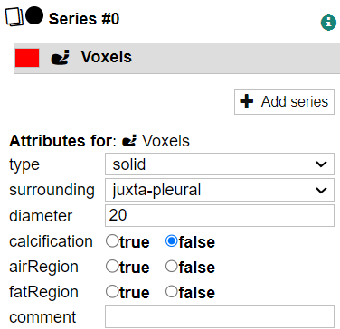
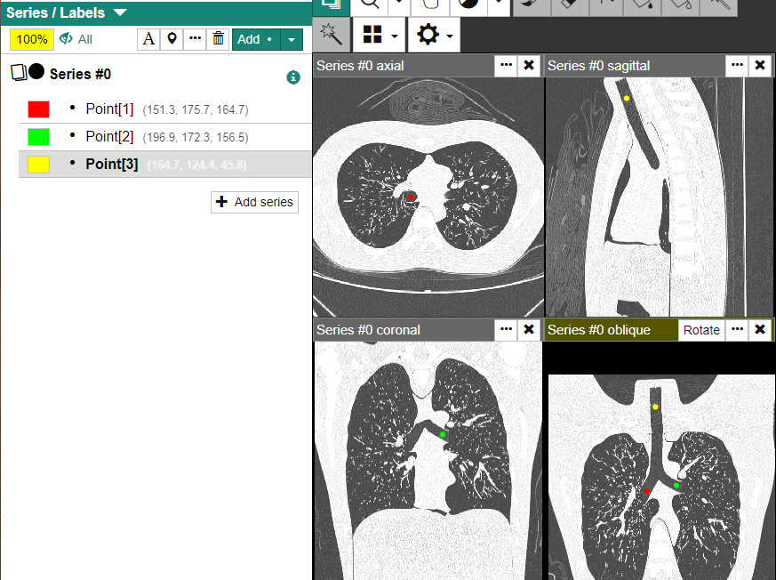

To start editing a case, click one of the \[View\] buttons to the right of the [Case Search](./case-search) result to enter a case editor.

## Case Editor Overview

After entering the case editor, you will see something like the below:

Case Info
: Displays the case ID, the patient information (if you have sufficient priviledges), the project this case belongs to, and the tags of the case.

Revision Selector
: Displays the current revision in which you are editing. You can switch the revision to see a previous revision. It is also possible to edit a case based on a previous revision, too.

Viewer Pane
: Displays the image of the DICOM series. If the series contains a 3D volume, four viewers (axial, coronal, sagittal, and oblique) are displayed by default.

Tool Bar
: You can select the tool you are using.

Series / Labels
: Displays the list of series belonging to this case and the list of labels for each series. You can also edit the label attributes here.

Case Attributes
: Displays the case attributes editor.

## Using the DICOM Viewer

### Tools

You can control the left-drag behavior by selecting one of the tools on the toolbar.

import { Icon } from '../icon';

<dl>
<dt><Icon icon="rs-icon-pager" /> Paging (<kbd>P</kbd>)</dt>
<dd>Scrolls the current image.</dd>
<dt><Icon icon="rs-icon-zoom" /> Zoom (<kbd>Z</kbd>)</dt>
<dd>Zooms the image. The pull-down menu to the right of the icon allows you to zoom the current displayed image at a fixed magnification (×8, ×4, ×2, ×1/2, ×1/4, ×1/8).</dd>
<dt><Icon icon="rs-icon-hand" /> Hand (<kbd>H</kbd>)</dt>
<dd>Pans the current image.</dd>
<dt><Icon icon="rs-icon-window" /> Window (<kbd>W</kbd>)</dt>
<dd>Changes the display window (window level, window width) of the current image by dragging. You can also use the pull-down menu to the right to apply a preset window or enter the window values manually.</dd>
</dl>

Characters in boxes are keyboard shortcuts.

### Paging (Scrolling) Images

There are several ways to page (scroll) the current image.

- Select the Paging <Icon icon="rs-icon-pager" /> tool (by clicking the icon or pressing the <kbd>P</kbd> key) and left-drag on the image you want to page.

- Hover the mouse cursor over the image you wish to scroll and use the mouse wheel.

- Use a scroll bar on each viewer. If the scroll bar is not visible, open the gear icon menu and change the scroll bar visibility option.

  

  

### Managing Viewer Layout

By default, if your primary series is 3D, a 2&times;2 layout is applied, each showing an axial, coronal, sagittal or oblique slice. You can quickly change the layout by using the layout menu on the tool bar.

You can change the layout of the viewers in several ways:

- Drag the horizontal bar at the top of each viewer to move its position.
- Double click a series on the left panel to quickly reveal the series.
- Drag a series from the left panel into the viewer area.

You can increase the number of rows or columns by dragging an item into the "gap" between two viewers. A new row or column will be inserted when you drop the item. To remove a row or a column, remove or move all viewers in that row/column. An empty row/column will be automatically removed.

Additionally, you can change the section type of the viewer using the dropdown menu at the top of each viewer.

### Various Display Settings

To show reference lines, check the \[Show reference line\] option in the gear menu.

To change interpolation methods, check or uncheck the \[Trilinear filtering\] menu. When checked, the display will be smoother, but the display speed may be slower.

By default, 2D labels are visible semi-transparently within two slices before and after the slice on which they are defined. You can change the visibility so that they are displayed regardless of the currently displayed slice.

## Editing Labels

The main thing to do in the case editor is to edit labels. In CIRCUS DB, you can create various types of labels.

### Creating a New Label

Select the series to which you want to add a label, and then select the label type using the \[Add\] pull down menu.

<dl>
<dt><Icon icon="circus-icon-annotation-voxel"/> Voxel</dt>
<dd>Makes a free-form ROI (region of interest) by voxel painting.</dd>
<dt><Icon icon="circus-icon-annotation-cuboid"/> Cuboid (3D)</dt>
<dd>Defines a cuboid (or cubic) ROI (region of interest).</dd>
<dt><Icon icon="circus-icon-annotation-ellipsoid"/> Ellipsoid (3D)</dt>
<dd>Defines ellipsoid (or spherical) ROI.</dd>
<dt><Icon icon="circus-icon-annotation-rectangle"/> Rectangle (2D)</dt>
<dd>Defines recutangular (or square) ROI.</dd>
<dt><Icon icon="circus-icon-annotation-ellipse"/> Ellipse (2D)</dt>
<dd>Defines a ellipse (or circular) ROI.</dd>
<dt><Icon icon="circus-icon-annotation-point"/> Point</dt>
<dd>Defines a point label with no width or height.</dd>
<dt><Icon icon="circus-icon-annotation-ruler"/> Ruler (3D)</dt>
<dd>Defines a label to measure the length between two points.</dd>
</dl>

:::tip
CIRCUS remembers the last selection you made. To create another label of the same type, you can just click the \[Add\] button.
:::

Among these, Voxel labels are special and are explained in a [separate page](./case-voxel-labels).

Labels can be sorted manually by dragging, but you cannot move a label to under another series when multiple series are in a case.

### Moving and Resizing Labels

_Note: the this description applies for labels other than Voxel_.

You can move or resize a 2D/3D label by dragging its edges or corners, just as you do in word processing or presentation software.

You can change the resizing behavior using the following modifier keys.

- Press the <kbd>Shift</kbd> key while dragging to maintain the aspect ratio of the label. Use this when you have to define a label with the same width/height(/depth), e.g., precise cuboid.
- Press the <kbd>Ctrl</kbd> key while dragging to fixate the location of the center of the label.

You can also always turn on these behaviors without pressing a key. To do so, either use the gear icon menu or visit the [preference page](./user-preference).

### Changing Label Appearance

You can change the color and the alpha (opacity) of a label by clicking the color box at the top of the series list. You can customize the color palette or the default alpha value in the [Preference](./user-preference) page.

To temporarily hide a label, click the color box of the label. To temporarily hide _all_ labels, click the eye icon at the top of the series list.

### Other Label-related Operations

- You can change the name for each label using the \[A\] icon at the top of the series list. Labels can be named arbitrarily, with the exception of some label names that have special meanings (see "Three-points-to-section").
- Click the \[Reveal\] button to show the label at the center of each viewer.

## Case and Label Attributes

"Attributes" refers to any additional data associated with a case or label. In CIRCUS DB, administrators can define the data type of an attribute. For example, there may be a checkbox to describe a visual feature of a lesion ("spiculated", "irregular") or a select box for the patient characteristics ("smoker", "never-smoker", "ex-smoker").

You cannot save a revision when required attributes are left empty.

If no attributes have been set by an administrator, the attribute editors are not displayed.

## Tags

Tags are keywords that can be used to categorize cases. You can use tags to indicate the common state of a case (for example, "Reviewed", "High Priority"). Tags are displayed prominently on the screen, and can be changed both in the Case Search screen and the Case Editor screen, making them a useful tool for organizing your workflow.

Note the following characteristics of tags:

- Tags are defined by the administrator for each project.
- Tags are **not versioned** using the revision mechanism. You can add or remove tags freely without incrementing a revision.
- Tags are **shared by all users**. If you want to manage a personal collection of cases, use [My List](./search-preset.md) instead.

To add/remove tags, use the Tags editor at the top of the Case Editor screen, or check cases in the Case Search screen and use the tag menu that appears above the checkboxes.

## Save and Revert

You must save your work before leaving the Case Editor screen. Click the Save button and enter a **revision message** describing the contents of your edit. The revision message can be anything, but if you repeat the same work many times for different cases, you can define a saved revision message (see the [Preference](./user-preference) page).

If something goes wrong, you can use the \[Revert\] menu to abandon the current edit and restore the last saved status.

## Undo and Redo

Use the &#x25C0; and &#x25B6; buttons to undo or redo operations. (Keyboard shortcuts are <kbd>Ctrl + Z</kbd> and <kbd>Ctrl + Shift + Z</kbd>, respectively).

:::info
The size of the undo buffere is limited. If you are doing something experimental and may have to undo dozens of steps, save a revision instead.
:::

## Three-points-to-section

This function allows you to find an oblique section that contains three Point labels you define.

1. Create three Point labels with the same name but with different suffixes: `[1]`, `[2]`, and `[3]`. For best results, place the three points as far apart as possible and not in a straight line.

1. Click one of the Point labels to make it active.

1. Select the \[Three points to section\] menu. A new oblique viewer will be created showing the three Point labels.

1. If you adjusted the location of the Point labels, repeat the step above.

## Exporting Data

You can download the case data (original images, label data, case attributes).

:::caution

- Archive files are created on the server side, so unsaved labels cannot be downloaded. **You must save a revision** before using this feature.
- You need sufficient privileges to do this. When the export menu is unavailable, consult the administrator.

:::

Select "Export as MHD" from the menu button in the upper right corner of the screen. The following dialog box will appear. Select the settings and click the "Start download" button.

Voxel labels
: Select whether you want to output each label in a separate volume (Isolated) or all labels in one volume (Combined).

MHD file line endings
: Select the newline code of the MHD file (LF (Linux) or CR + LF (Windows)).

Comression format
: Select the compression format of the exported data (tar.gz or ZIP).

An archive file with the following files will be generated. `vol0`, `vol1` and so on correspond to the series of the case.

`vol0.raw, vol1.raw, ...`
: Contains the original volume data from the DICOM series.

`vol0.mhd, vol1.mhd, ...`
: Volume metadata in the MHD format.

`vol0_label0.raw/mhd, ...`
: Voxel label data (when the label type of Voxel).

`data.json`
: Contains other data in JSON format, including label names, label geometry data, case/label attributes.

:::note

The position is written in mm, starting from the upper left voxel of the volume.

:::

The archive files are created on the server side and may take a few minutes. You can close the dialog or the browser tab if you wish. Once successful, the archive file can be downloaded from the Tasks page.
