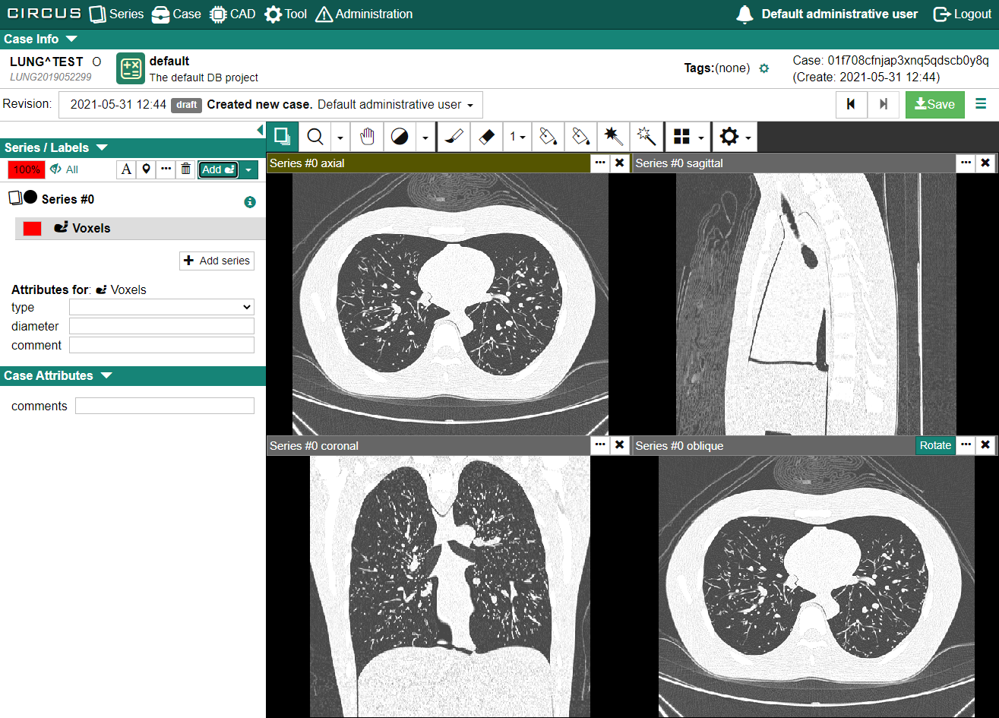
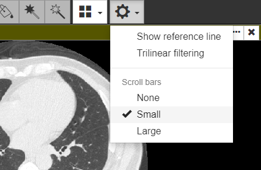
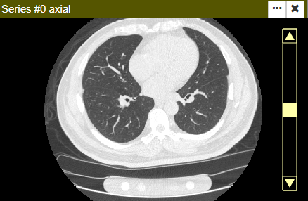
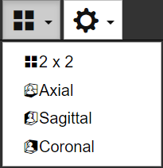
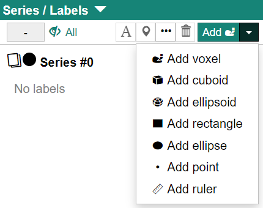
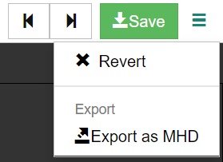

Case Searchの検索結果のリスト各行にある[View]ボタンをクリックすると、Case Detail画面が表示されます。Case Detail画面ではラベルおよび属性情報の入力を行います。

## Case Detail画面の構成

Case Detail画面は以下の要素で構成されています。

### Case Info

Case ID、患者情報（患者情報表示権限を有する場合）、プロジェクト名、タグが表示されます。

### Revision

現在表示しているリビジョンの情報が表示されています。プルダウンメニューになっているので表示するリビジョンを切り替えることも可能です。

### DICOM Viewer Component

DICOMシリーズより生成したボリュームデータが表示されます。初期状態ではaxial断面のほかにMPR(coronal, sagittal, oblique)の4断面が表示されます。

### Series / Labels

ケースに属しているシリーズ、ならびに各シリーズに属しているラベルの情報が表示されるとともに、ラベルの属性情報の入力インターフェイスがあります。

### Case Attributes

ケースの属性情報の入力インターフェイスがあります。

## DICOM Viewer Component

### 左ドラッグ時の操作について

### 画像のスクロール

DICOM Viewer Componentの画像は以下の方法でスクロールすることができます。

- マウス左ドラッグ操作をPagerに設定(Pagerアイコンをクリック、もしくは"P"キーを押す)した上で、スクロールしたい断面で左ドラッグをします。

- スクロールしたい断面でマウスカーソルを合わせて、マウスホイールでスクロールします。

  :::note

  現状ではマウスホイールの動きと画像のページングが逆になっています（マウスホイールを下に動かすと画像が上方向にページングされます）。

  :::

- 設定ツールバーの[Scroll bars] で [Small] もしくは [Large]を選択し（左下図）、スクロールしたい断面の右端にマウスカーソルを合わせるとスクロールバーが表示されます（右下図）。

  || |
  |:---:|:---:|
  | スクロールバーの設定 | スクロールバーの表示 |

### 画面表示の切替

初期状態はaxial断面、coronal断面、sagittal断面、oblique断面が2行×2列で表示されていますが、ツールバーにてaxial、coronal、sagittalのみの表示に切り替えることができます。

## ラベルの新規入力

"Series/Labels" の[Add ●]の右側のプルダウンメニューよりラベルの種類を選択します。

CIRCUS DBで実装しているラベルは以下の通りです。

### voxel

ボクセル単位で塗りつぶすラベルです。

### ROI (2D/3D)

CIRCUS DBでは2Dおよび3Dの関心領域(ROI)をラベルとすることもできます。初期状態ではラベル追加時の画像の中心に設置されます。

#### cuboid (3D)

直方体ROIです。初期状態では立方体です。

#### ellipsoid (3D)

楕円体ROIです。初期状態では正球です。

#### rectangle (2D)

長方形ROIです。初期状態では正方形です。

#### ellipse (2D)

楕円ROIです。初期状態では正円です。

:::tip

2D ROIは設定したスライスの上下3スライスでは半透明で表示されます。

:::

### point

点状のラベルです。初期状態ではラベル追加時の画像の中心に設置されます。

### ruler

サイズ計測用ラベルです。初期状態ではラベル追加時の画像の中心に設置されます。

## ボクセルラベルに

## ROIの移動・サイズ変更

### 移動

マウスカーソルをROIの端に合わせると、マウスカーソルが十字矢印に変わります。マウスの左ボタンを押しながらドラッグするとROIが移動します。

### サイズ変更

マウスカーソルをROIの端にある &#9633; に合わせると、マウスカーソルが両矢印に変わります。マウスの左ボタンを押しながらドラッグをすることでROIのサイズを変えられます。

- Shiftキーを押しながらサイズを変えると各軸のアスペクト比が維持されます。
- Ctrlキーを押しながらサイズを変えるとROIの中心が固定された状態でサイズが変わります。

## Undo / Redo / Revert

- 画面右上[Save]ボタンの左側にある&#x25C0;、&#x25B6;ボタンで操作のundo、redoが行えます(undoはCtrlキー+Zキーでも行えます）。
- 画面右上[Save]ボタンの右側にあるメニューボタンより[Revert]を選択すると、Revisionの最初の状態まで戻すことができます。ただし、Revertした場合はこれまでの操作の記録が消去されます。

## エクスポート

ケースのデータ（元画像、voxelラベルのボリュームデータ、属性情報）をダウンロードするためには、画面右上のメニューボタンから[Export as MHD]を選択します。以下のダイアログが表示されますので、条件を選択した上で、[Start download]ボタンをクリックします。

- Voxel labels
  - 現在はラベル毎に別々のボリュームで出力する(Isolated)か、全てのラベルを1つのボリュームで出力するかを選択します。
- MHD file line endings  
  - mhdファイルの改行コードをLF(Linux)、CR + LF(Windows)を選択します。
- Comression format
  - エクスポートデータの圧縮形式を選択します(tar.gz or ZIP)。

### 生成されるデータ

#### vol[シリーズ番号].mhd (+.raw)

シリーズの元画像のボリュームデータです。

#### vol[シリーズ番号]_label[ラベル番号].mhd (+.raw)

voxelラベルデータです。

#### data.json

症例の属性情報(JSON形式)です。

:::tip

ROI、point、rulerの情報はdata.jsonに含まれます。位置はボリュームの左上ボクセルを原点としたmm単位で書かれています。

:::

