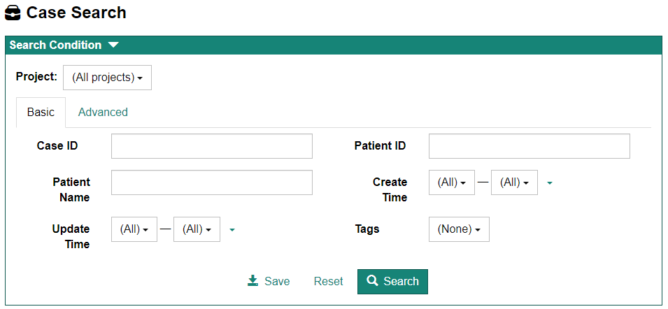
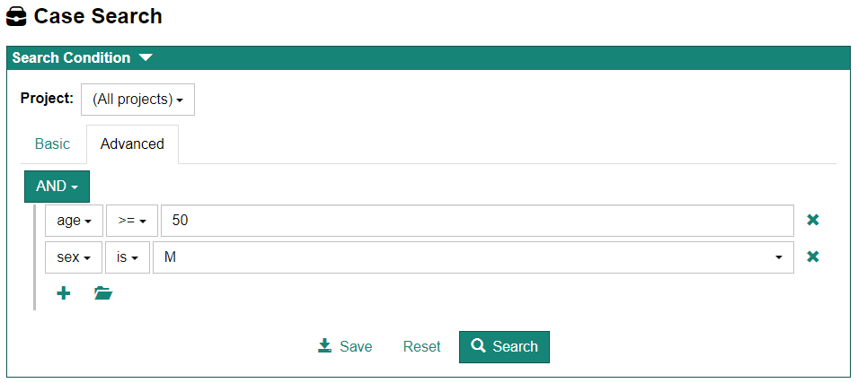
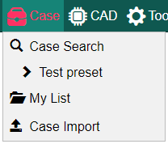
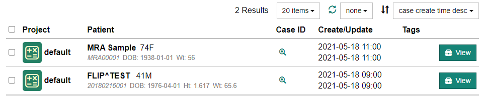

## Case Search 画面の表示方法

画面上部のメニューより[Case] - [Case Search]を選択するとCase Search画面が表示されます。

:::tip

ホーム画面中央の[Case Search]ボタンをクリックしても表示されます。

:::

## 検索条件の設定

Case Search画面の上部の"Search Condition"にて検索条件を設定します。検索条件の設定方法として、BasicおよびAdvancedの2種類があります。 それぞれはタブによって切り替えることが出来ます。

:::note

検索条件設定画面が表示されていない場合は"Search Condition"上部の &#9660; をクリックします。

:::

### Basic

Basicでは基本的な検索条件により検索ができます。

### Advanced

Advancedでは検索条件をより詳細に設定することができます。Basicにはない検索項目(age, sex)を用いた検索も行うことができます。

### 検索条件の保存(preset)

よく使用する検索条件をpresetとして保存することができます。検索条件設定画面下部の[Save]ボタンをクリックすると、preset nameを設定するダイアログが表示されますので、名前を設定して[OK]ボタンをクリックします。

保存したpresetはメニューの[Seres]より呼び出すことができます。

## 検索結果のリスト表示

検索結果は画面下部に表示されます。

- リスト各行の"Uid"列にある虫眼鏡アイコンをクリックすると、Case IDが表示されます。Case IDをクリップボードにコピーすることもできます。 

- リスト各行の[View]ボタンをクリックすると、Case情報入力画面が表示されます。

