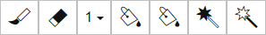
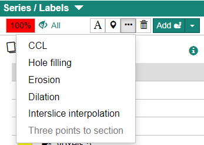
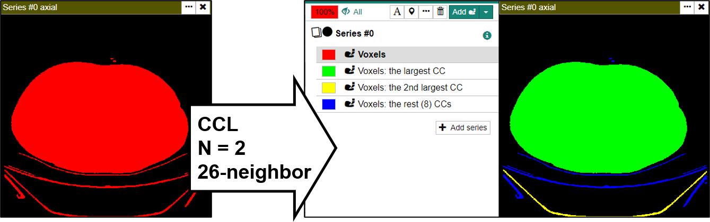
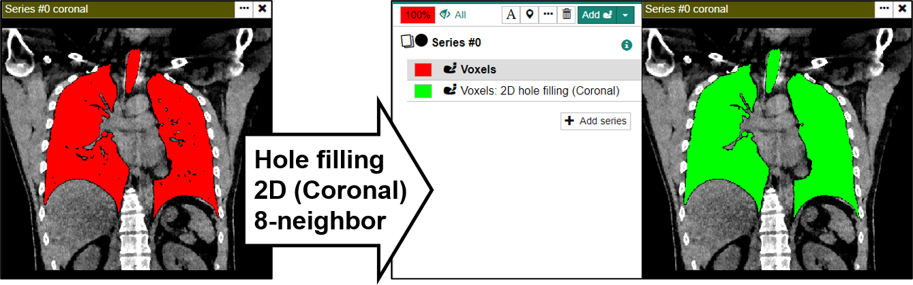

Voxel Label is a powerful tool that allows you to define 3D ROI by "painting" voxels. To create a new voxel label, use the \[Add\] menu at the top of the series list.

## Voxel Label Tools

By creating and activating a voxel label, the following tools become available.

import { Icon } from '../icon';

<dl>
<dt><Icon icon="rs-icon-brush" /> Brush (<kbd>B</kbd>)</dt>
<dd>Paints the clicked position with a square pen.</dd>
<dt><Icon icon="rs-icon-eraser" /> Eraser (<kbd>E</kbd>)</dt>
<dd>Unpaints the clicked position.</dd>
<dt>(Width dropdown)</dt>
<dd>Use this pulldown menu to change the width of the brush/eraser.</dd>
<dt><Icon icon="rs-icon-bucket" /> Bucket (<kbd>Shift</kbd>+<kbd>B</kbd>)</dt>
<dd>Fills the connected unpainted area from the clicked position.</dd>
<dt><Icon icon="rs-icon-bucket-erase" /> Bucket Erase (<kbd>Shift</kbd>+<kbd>E</kbd>)</dt>
<dd>Erases the connected painted area from the clicked position.</dd>
<dt><Icon icon="rs-icon-wand" /> Wand (<kbd>M</kbd>)</dt>
<dd>Paint voxels with a certain range of pixel values based on the pixel value of the clicked position. The threshold and maximum distance can optionally be set.</dd>
<dt><Icon icon="rs-icon-wand-eraser" /> Wand Erase (<kbd>Shift</kbd>+<kbd>M</kbd>)</dt>
<dd>Like Wand, but erases the painted voxels.</dd>
</dl>

:::note

The Wand tool and Wand Erase tools will not be enabled until all volume data has been loaded (while the loading indicator is displayed).

:::

## Processing Voxel Labels

Click the \[…\] button to perform several operations against the active voxel label.

### Connected Component Analysis (CCL)

Splits the active voxel label into separate voxel labels for each connected group of voxels in 3D.

Maximum number of connected components
: Creates N voxel labels in the descending order of volume. Remaining voxels are grouped into a single voxel label.

Neighbors to decide same CC
: Method to judge if two voxels are connected (6- or 26-neighbors)

Maximum number of tentative labels
: Increase this number when your voxel label is complicated.

### Hole Filling

Performs a hole-filling on the active voxel labe.

Dimension
: Select 2D-based hole-filling or 3D-based hole-filling.

Orientation
: Processes each slice in the direction specified here (only applicable in 2D mode)

Neighbors to decide same CC
: Method to judge if two voxels are connected (4- or 8-neighbors in the 2D mode, 6- or 26-neighbors in 3D mode)

Maximum number of tentative labels
: Increase this number when your voxel label is complicated.

:::note
When performing CCL and hole-filling on voxel labels with complex shapes, increasing the maximum number of tentative labels may make the calculation possible. The maximum number of tentative labels depends on the memory of the PC used.
:::

### Erosion and Dilatation

Performs erosion or dilation on the active voxel label.

Width
: Width of the structuring element.

Height
: Height of the structuring element.

nSlices
: Depth of the structuring element.

Structuring element
: The shape of the structuring element.

### Interslice Interpolation

Performs an interslice interpolation for the active voxel label.

Orientation
: The orientation of the guiding slices.

