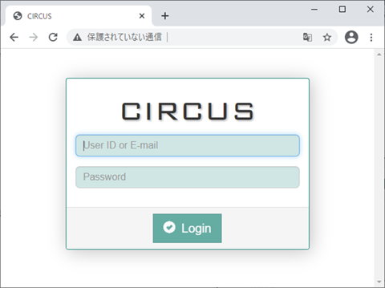
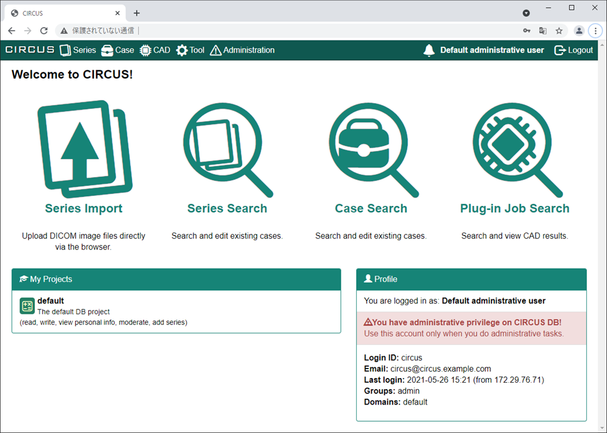

## CIRCUSへのログイン

WebブラウザでCIRCUSのログイン画面を表示し、ユーザID ならびにパスワードを入力して [Login] ボタンをクリックします。

## ホーム画面

ログインに成功すると以下のようなホーム画面が表示されます。

ホームページの上部メニューバーに表示されている項目は以下の通りです(ユーザにより表示項目が変化します)。

| 表示名 |　説明 |
|-|-|
| CIRCUS | クリックするとホーム画面に戻ります。 |
| Series | DICOMシリーズに関する項目が表示されます。 |
| Case   | CIRCUS DBの症例データに関する項目が表示されます。 |
| CAD    | CIRCUS CSの処理結果などに関する項目が表示されます。 |
| Tool   | 各種ツールに関する項目が表示されます。 |
| Administration | CIRCUSの設定に関する項目が表示されます（管理者権限を有するユーザのみ表示されます）。 |
| Logout | ログアウトします。 |

画面中央にある4書類のアイコンをクリックすると、それぞれ以下のページに移動します。

| 表示名 |　説明 |
|-|-|
| Series Import | DICOM画像のアップロード画面が表示されます。 |
| Series Search | DICOMシリーズの検索画面が表示されます。 |
| Case Search | CIRCUS DBの症例データの検索画面が表示されます。 |
| Plug-In Job Search | DICOM CSのplug-in実行結果の検索画面が表示されます。 |
