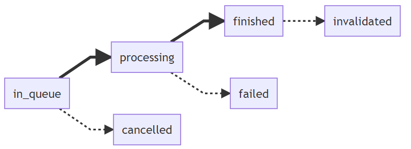
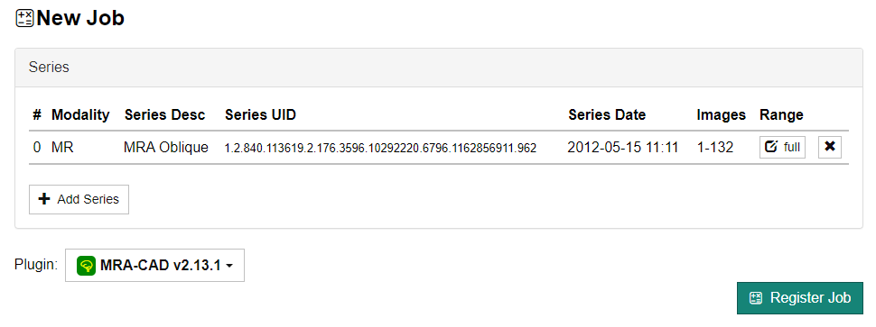
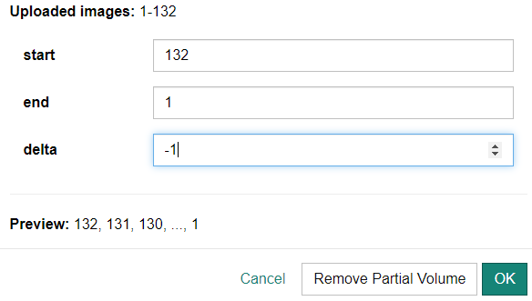
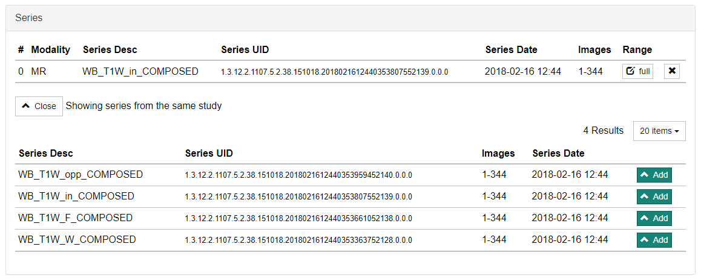

## Introduction

In CIRCUS CS, the execution instructions of plug-ins are registered as **jobs**, and a job ID is assigned at the time of registration. Jobs are executed one at a time in sequence (multiple jobs cannot be executed simultaneously on one machine).

### Job Status

In CIRCUS, the status of a job transitions as follows.

`in_queue`
: The job has been submitted and is waiting for execution.

`processing`
: The job is in the process of execution (including pre-processing, main processing, and post-processing).

`finished`
: The job has completed successfully.

`cancelled`
: The job has been cancelled before the start of execution.

`invalidated`
: The job has been marked as invalid after the successful execution. Common reasons for this include registering a job with a wrong plugin, or registering a job before completely uploading the series.

`failed`
: The job has not completed successfully.

## Creating a New Job

1. [Import the DICOM images](./series-import) you want to use.

1. Go to [Series Search](./series-serch) screen and find the series you want to make a case from. From the [+ New] dropdown menu, select "New Case".

1. In the "New Job" screen, do the following:

   - Select the plug-in to execute.
   - (Optional) If only the subset of the series is used in the case, specify the image range by clicking "Range" button. By default ("auto"), all the images in the first consecutive segment of the series will be used.
   - (Optional) If you want a case with more than one series, click the "Add Series" button and add the series you need.

   

:::note

If you try to register a job with the same combination of series and plugin as one that has already been registered, a confirmation screen will be displayed (jobs in the `failed`, `cancelled`, or `invalidated` status will be excluded from this check). Clicking the [OK] button will force the job to be registered.

:::

:::caution

At the moment, it is possible to specify any series as the input for a plug-in. A feature to declare the minimum conditions (such as modality) for series that the plugin can process will be implemented in the future.

:::

### Using Only Part of the Series

Sometimes not all images of interest in a DICOM series are contiguous. For example, the first image in a series may contain a "localizer" image with embedded reference lines. Or the images of interest may be interleaved (e.g. 1, 4, 7, 10, ..., 61) or stored in reverse order (e.g. 150, 149, 148, ..., 1). In such cases, you can manually specify image ranges of the series. To do so, click the "Range" button for each series. In the dialog that opens, specify the "Start", "End" and "Delta" values. If the images are stored in an interleaved manner, enter a delta value greater than 1. If the images are stored in reverse order, enter a negative delta value.

### Using More than One Series

A case/job can contain more than one series. To add another series to a case, click the "Add Series" button and select the series you want to include.

## Cancel or Invalidate a Job

You can cancel a job that has not yet started executing or invalidate a job that has already finished executing. To do this, use the menu on the [Job Search](./plugin-job-search) screen.

:::info
Currently, there is not way to abort a job that is in the process of execution.
:::
