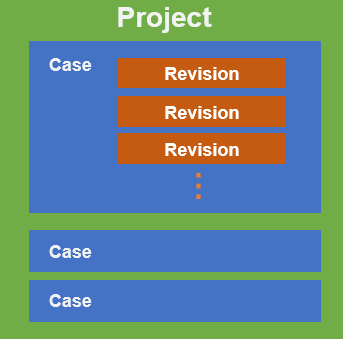
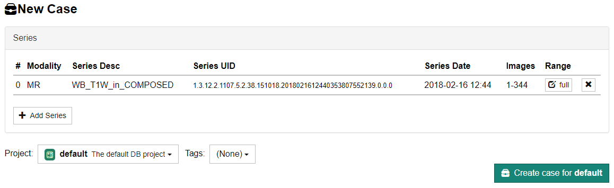

## Data Structure of CIRCUS DB

In CIRCUS DB, clinical data are managed in units called **Cases**. Cases are created by users and stored in a container called **Project**. Case data are versioned in **Revisions**, which will be created every time a user saves the editing data.

A case must belong to only one project. A project can contain as many cases as you want. Each case and project has an unique ID (caseId and projectId).

Only administrators can [create and manage projects](../admin/project-settings).

## Creating a New Case

:::info
You need sufficient privileges to create a case in a project. If the following steps do not work, contact the administrator of your CIRCUS installation.
:::

1. [Import the DICOM images](./series-import) you want to use.

1. Go to [Series Search](./series-search) screen and find the series you want to make a case from. From the [+ New] dropdown menu, select "New Case".

1. In the "New Case" screen, do the following:

   - Select the project this case will belong to. Only the administrator can create or edit projects.
   - (Optional) If only the subset of the series is used in the case, specify the image range by clicking "Range" button. By default ("auto"), all the images in the first consecutive segment of the series will be used.
   - (Optional) If you want a case with more than one series, click the "Add Series" button and add the series you need.
   - (Optional) Add tags for the case.

   

1. Press the "Create Case for (project name)" button.

### Using Only Part of the Series

Sometimes not all images of interest in a DICOM series are contiguous. For example, the first image in a series may contain a "localizer" image with embedded reference lines. Or the images of interest may be interleaved (e.g. 1, 4, 7, 10, ..., 61) or stored in reverse order (e.g. 150, 149, 148, ..., 1). In such cases, you can manually specify image ranges of the series. To do so, click the "Range" button for each series. In the dialog that opens, specify the "Start", "End" and "Delta" values. If the images are stored in an interleaved manner, enter a delta value greater than 1. If the images are stored in reverse order, enter a negative delta value.

### Using More than One Series

A case/job can contain more than one series. To add another series to a case, click the "Add Series" button and select the series you want to include.

