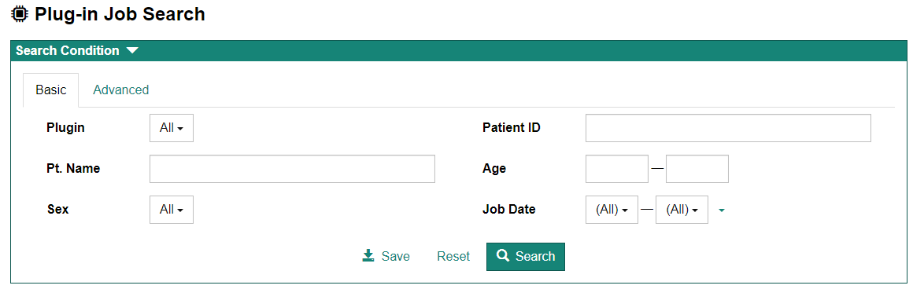
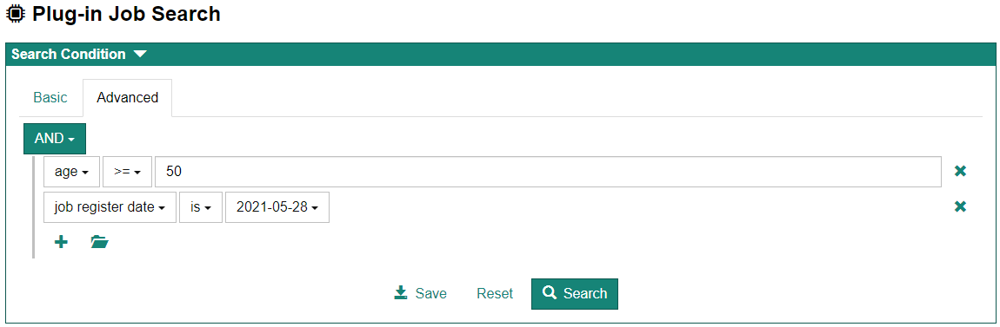
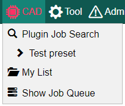
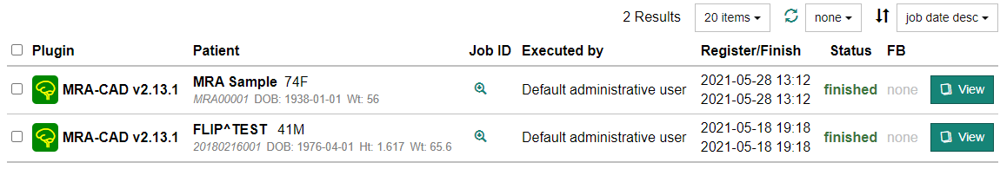

## Plug-in Job Search 画面の表示方法

画面上部のメニューより [CAD] - [Plug-in Job Search] を選択すると Plug-in Job Search 画面が表示されます。

:::tip

ホーム画面中央の [Plug-in Job Search] ボタンをクリックしても表示されます。

:::

## 検索条件の設定

Plug-in Job Search 画面の上部の "Search Condition" にて検索条件を設定します。検索条件の設定方法として、Basic および Advanced の 2 種類があります。 それぞれはタブによって切り替えることが出来ます。

:::note

検索条件設定画面が表示されていない場合は "Search Condition" 上部の &#9660; をクリックします。

:::

### Basic

Basic では基本的な検索条件により検索ができます。

### Advanced

Advanced では検索条件をより詳細に設定することができます。Basic にはない検索項目(job register date, job finish date)を用いた検索も行うことができます。

### 検索条件(preset)の保存

よく使用する検索条件を preset として保存することができます。検索条件設定画面下部の [Save] ボタンをクリックすると、preset name を設定するダイアログが表示されますので、名前を設定して [OK] ボタンをクリックします。

保存した preset はメニューの[Seres]より呼び出すことができます。

:::note

preset の削除方法は [ユーザ固有の設定](user-preference.md) ご参照ください。

:::

## 検索結果のリスト表示

検索結果は画面下部に表示されます。

- リスト各行の"Job ID"列にある虫眼鏡アイコンをクリックすると、Job ID が表示されます。Job ID をクリップボードにコピーすることもできます。

- リスト各行の [View] ボタンをクリックすると、Plug-in の処理結果画面が表示されます。
