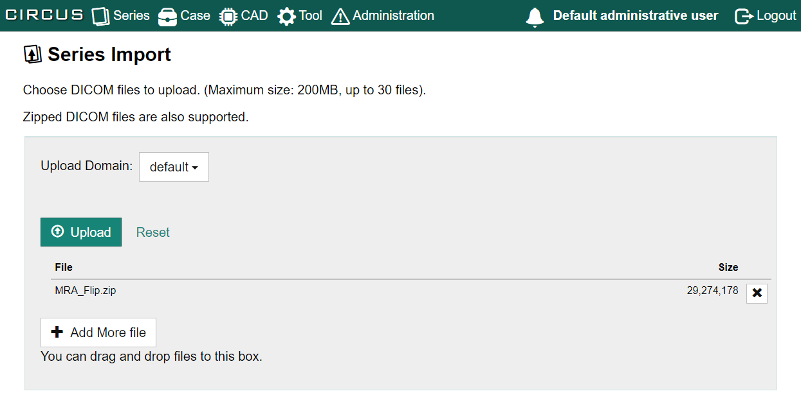

## Overview

CIRCUS manages DICOM data based on series identified by Series Instance UID (0020,000E).

To import DICOM files into the CIRCUS system, you can upload DICOM files or ZIP archive files containing DICOM files via your web browser.

:::tip Other methods to import series

Alternatively, an administrator can [use Admin CLI to import series](../admin/admin-cli.md) or set up a [DICOM Storage Server](../admin/dicom-storage-server.md) to allow other devices (CT, MRI, etc.) to transfer DICOM images directly to CIRCUS. The Admin CLI is the most efficient because it does not use a network connection. If you are importing a large amount of DICOM data, consider contacting your administrator to use these non-browser-based transfer methods.

:::

### Domain

Each DICOM series imported to CIRCUS must belong to one (and only one) **domain**. A domain is a string that identifies where the images came from (typically, an institute/hospital name). Only an administrator can configure the domains used in a CIRCUS installation, or which domain each user can upload images to.

### Uploading Anonymized DICOM

CIRCUS does not use DICOM tags related to patient information (0010,XXXX), such as Patient ID and Patient Name, to identify series. It is safe to anonymize these tags before importing series into CIRCUS. However, **Series Instance UID is the primary key for identifying series in CIRCUS**. Therefore, you will get an error if you try to import DICOM series with a malformed (or empty) Series Instance UID. If you really need to anonymize the Series Instance UID, you can use fake strings that look like valid UIDs (this is not a DICOM-compliant approach, so don't share such files with external parties).

## Importing DICOM Files via Browser

1. Go to the Series Import page using one of the following links.

   - [Series] - [Series Import] menu in the top menu.
     

   - [Series Import] on the home screen.

1. Click the "Select File" button in the center of the screen to select the files to upload, or drag and drop the files into the box.

   

1. Select the **domain** the uploaded series will belong to, and the click the [Upload] button.

   

   :::important

   You cannot change the domain of the series after they have been uploaded.

   :::

1. When the upload process is complete, a message will appear at the top of the screen indicating that the import has begun. The import is done in the background, so you can leave the page or close the tab if you wish.

   

1. To check the import status, click the bell icon at the top of the screen.

   

### Upload Limitations

The following limitations apply when uploading DICOM data from a browser.

- Maximum number of files: 30
- Total file size: 200 MB

:::info

An administrator can increase these limits via a configuration file.

:::

When uploading a DICOM file from the Series Import screen, the compression status of the DICOM files remains the same (no lossless compression or decompressed is performed).

## Deleting DICOM Series

You can delete a series if it has not been used as part of a case or plug-in job. To do this, go to the Series Search page and use the menu to the right of the series you want to delete.

You cannot delete a series if it has already been used as part of a case or plug-in job.
