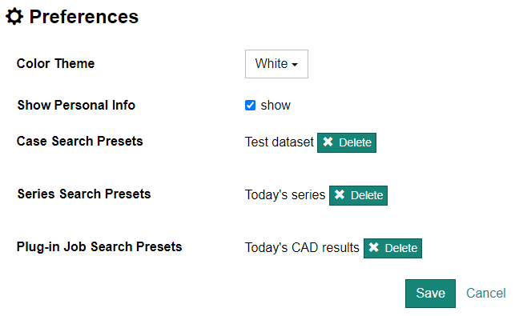

## ユーザ固有の設定

画面上部のメニューより [Tool] - [Preference] を選択するとユーザ固有の設定画面が表示されます。

設定できる項目は以下の通りです。変更した設定を反映させるためには画面下部の [Save] ボタンをクリックしてください。

### Color Theme

各ページの背景色を設定します（白 or 黒）

### Show Personal Info

患者個人情報（患者 ID・氏名・生年月日）を表示できるかどうかを設定します。

### Search Presets の削除

各検索画面で作成した検索条件の preset を削除することができます。
